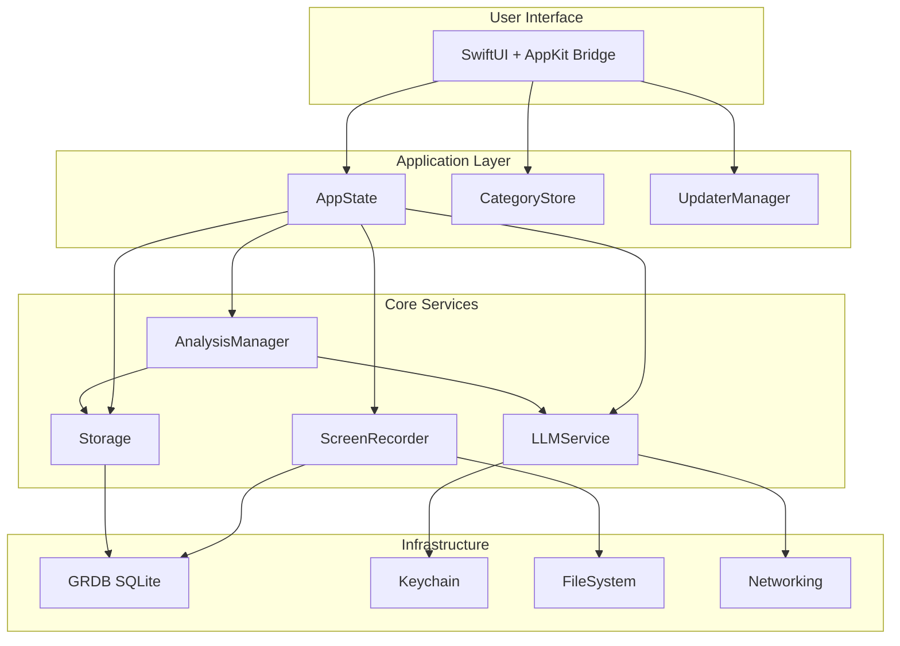
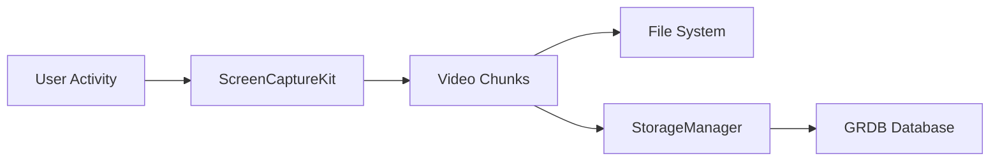
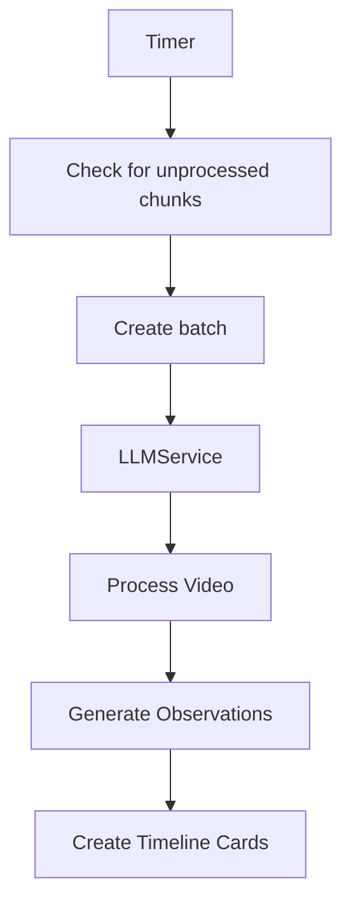
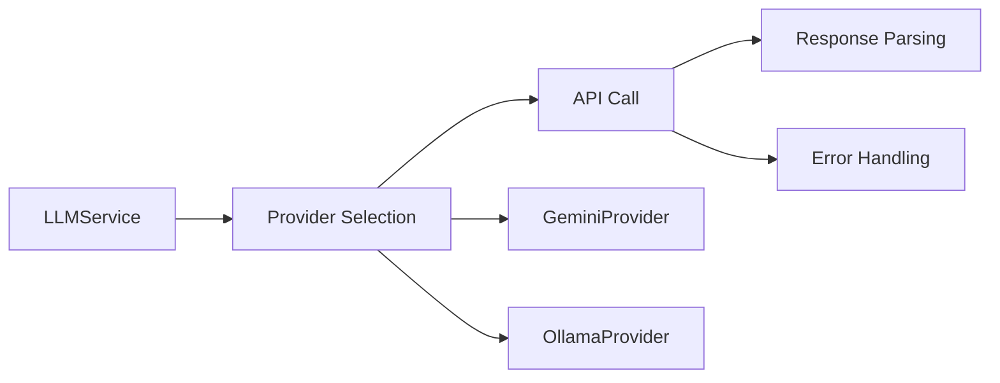
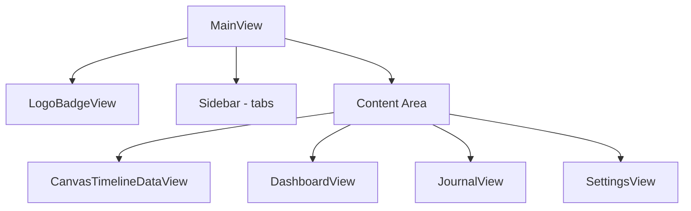
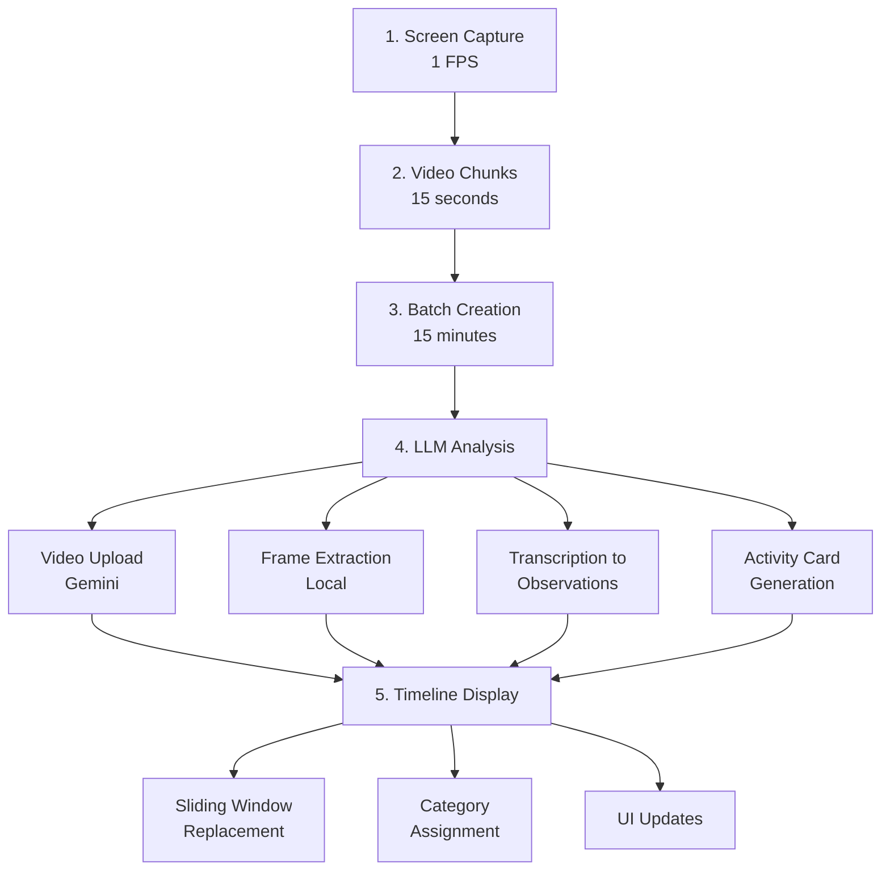
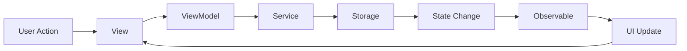

# Dayflow Architecture Overview

## System Architecture

Dayflow is a native macOS application built with SwiftUI that captures screen activity, analyzes it with AI, and presents an intelligent timeline of user activities.



## Directory Structure

```
Dayflow/
├── App/                    # Application lifecycle
│   ├── DayflowApp.swift   # @main entry point
│   ├── AppDelegate.swift  # System lifecycle hooks
│   ├── AppState.swift     # Global state management
│   └── InactivityMonitor.swift
│
├── Core/                   # Business logic
│   ├── AI/                # LLM provider implementations
│   ├── Analysis/          # Batch processing & timeline generation
│   ├── Recording/         # Screen capture & storage
│   ├── Security/          # Keychain management
│   ├── Thumbnails/        # Video thumbnail generation
│   └── Net/               # Favicon fetching
│
├── Models/                # Data structures
│   ├── AnalysisModels.swift
│   └── TimelineCategory.swift
│
├── Views/                 # User interface
│   ├── UI/               # Main app views
│   ├── Onboarding/       # Setup flow
│   └── Components/       # Reusable UI components
│
├── System/               # Platform integration
│   ├── AnalyticsService.swift
│   ├── StatusBarController.swift
│   └── UpdaterManager.swift
│
└── Utilities/            # Helpers
    ├── Color+Luminance.swift
    └── GeminiAPIHelper.swift
```

## Core Components

### 1. Screen Recording Pipeline

**ScreenRecorder.swift**
- Uses ScreenCaptureKit API
- Captures at 1080p, 1 FPS
- Creates 15-second H.264 chunks
- Auto-recovery after sleep/wake
- Multi-display support

**Flow**:


### 2. Analysis Pipeline

**AnalysisManager.swift**
- Runs every 60 seconds
- Groups chunks into ~15-minute batches
- Triggers LLM analysis
- Manages retry logic

**Flow**:


### 3. Storage Architecture

**StorageManager.swift**
- GRDB SQLite database
- Transaction support
- Migration system
- File URL management

**Key Operations**:
- `registerChunk()` - Add new recording
- `saveBatch()` - Group chunks
- `saveTimelineCards()` - Store analysis results
- `replaceTimelineCardsInRange()` - Sliding window updates

### 4. LLM Integration

**LLMService.swift**
- Provider abstraction layer
- Handles provider switching
- Error recovery
- Sliding window context (1 hour)

**Provider Flow**:


### 5. UI Architecture

**MainView.swift**
- Two-column layout
- Tab-based navigation
- Real-time updates via @Published

**Component Hierarchy**:


## Key Design Patterns

### 1. Actor Model for Concurrency
```swift
@MainActor
final class AppState: ObservableObject {
    @Published var isRecording = false
}
```

### 2. Protocol-Oriented Design
```swift
protocol LLMProvider {
    func transcribeVideo(...) async throws
    func generateActivityCards(...) async throws
}
```

### 3. Dependency Injection
```swift
.environmentObject(AppState.shared)
.environmentObject(categoryStore)
```

### 4. Repository Pattern
```swift
protocol StorageManaging {
    func fetchTimelineCards(forDay: String) -> [TimelineCard]
}
```

## Data Flow

### Recording to Timeline


### State Management


## Critical Design Decisions

### 1. 4 AM Day Boundary
- Natural alignment with work patterns
- Implemented in `Date.getDayInfoFor4AMBoundary()`
- Affects all timeline queries

### 2. Sliding Window Analysis
- 1-hour context window
- Prevents duplicate activities
- Maintains timeline continuity
- Replaces cards atomically

### 3. Chunked Recording
- 15-second chunks for resilience
- Easier error recovery
- Parallel processing capability
- Reduced memory footprint

### 4. Provider Abstraction
- Hot-swappable LLM backends
- Consistent interface
- Fallback strategies
- Cost/performance tradeoffs

## Security Architecture

### Credentials
- Keychain storage for API keys
- No plaintext storage
- Secure retrieval APIs
- Per-provider isolation

### Privacy
- Local-first design
- Optional cloud processing
- User-controlled data retention
- No automatic uploads

### Permissions
- Screen Recording permission required
- Handled gracefully in onboarding
- Re-prompt on failure
- Status monitoring

## Performance Optimizations

### Video Processing
- Hardware acceleration via AVFoundation
- Efficient codec selection (H.264)
- Temporary file cleanup
- Stream processing where possible

### Database
- Indexed queries on timestamps
- Batch operations
- Connection pooling
- Write-ahead logging

### UI
- Lazy loading in timeline
- Thumbnail caching
- Virtual scrolling
- Debounced updates

## Extension Points

### Adding New Providers
1. Implement `LLMProvider` protocol
2. Add to `LLMProviderType` enum
3. Update `LLMService` factory
4. Add configuration UI

### Custom Categories
1. Modify `TimelineCategory` model
2. Update `CategoryStore`
3. Enhance prompt generation
4. Add UI controls

### New Analysis Features
1. Extend `AnalysisModels`
2. Update database schema
3. Modify prompt templates
4. Add UI visualization

## System Requirements

### Runtime
- macOS 13.0+
- 8GB RAM (16GB for local AI)
- 1GB free disk space
- Internet for cloud AI

### Development
- Xcode 15+
- Swift 5.9+
- Apple Developer account for signing
- API keys for testing

## Monitoring & Debugging

### Logging
- Console.app integration
- Structured logging with prefixes
- Debug flags in UserDefaults
- LLM call logging in database

### Analytics
- PostHog integration
- Anonymous usage tracking
- Performance metrics
- Error tracking

### Debug Tools
- Menu bar debug menu
- Video chunk viewer
- Database inspector
- Prompt testing

## Future Architecture Considerations

### Planned Improvements
- Plugin system for providers
- Background processing service
- Cloud sync capability
- Multi-user support

### Technical Debt
- Migrate to Swift Data (from GRDB)
- Improve test coverage
- Add crash reporting
- Optimize memory usage

### Scalability
- Chunk processing parallelization
- Provider request queuing
- Cache layer for cards
- Incremental UI updates