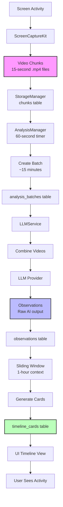

# Data Flow Documentation

## Overview

This document traces how data flows through Dayflow, from screen capture to timeline display, including all transformations and storage steps.

## Complete Data Flow Diagram



## Phase 1: Screen Recording

### Data Capture
```swift
// ScreenRecorder.swift
func startCapture() {
    // Configure at 1080p, 1 FPS
    streamConfig.minimumFrameInterval = CMTime(value: 1, timescale: 1)
    streamConfig.width = 1920
    streamConfig.height = 1080
}
```

### Data Format
**Video Chunks**: 15-second H.264 MP4 files
- Resolution: 1920x1080
- Frame rate: 1 FPS
- Codec: H.264
- Duration: 15 seconds
- Size: ~200-500 KB per chunk

### Storage Location
```
~/Library/Application Support/Dayflow/recordings/
├── 2025-01-15_14-30-00_000.mp4
├── 2025-01-15_14-30-15_000.mp4
└── 2025-01-15_14-30-30_000.mp4
```

### Database Record
```sql
INSERT INTO chunks (start_ts, end_ts, file_url, status)
VALUES (1736951400, 1736951415, '/path/to/chunk.mp4', 'completed')
```

## Phase 2: Batch Creation

### Trigger
```swift
// AnalysisManager.swift - Every 60 seconds
Timer.scheduledTimer(withTimeInterval: 60, repeats: true)
```

### Batch Logic
```swift
// Group chunks into ~15-minute batches
let targetBatchDuration: TimeInterval = 15 * 60 // 900 seconds

// Find unprocessed chunks
let chunks = fetchUnprocessedChunks(olderThan: currentTime - 60)

// Create logical batch
if totalDuration >= minimumBatchDuration {
    createBatch(chunks)
}
```

### Data Transformation
```
Chunks (many) → Batch (one)
[15s, 15s, 15s...] → [15 minutes total]
```

### Database Records
```sql
-- Create batch
INSERT INTO analysis_batches (batch_start_ts, batch_end_ts, status)
VALUES (1736951400, 1736952300, 'pending')

-- Link chunks to batch
INSERT INTO batch_chunks (batch_id, chunk_id)
SELECT 123, id FROM chunks WHERE start_ts >= ? AND end_ts <= ?
```

## Phase 3: Video Processing

### Video Combination
```swift
// LLMService.swift
let composition = AVMutableComposition()
for chunk in chunks {
    let asset = AVAsset(url: chunkURL)
    compositionTrack.insertTimeRange(range, of: track, at: time)
}
// Export as single video
exporter.export() → temporary.mp4
```

### Provider-Specific Processing

#### Gemini Path
```
Combined Video → Upload to Google → Get URI → Send for Analysis
     15 min         ~5 MB            fileUri      2 API calls
```

#### Local Path (Ollama)
```
Combined Video → Extract 30 Frames → Describe Each → Merge
     15 min         30 images         30 LLM calls    1 call
```

## Phase 4: AI Analysis

### Transcription Data
```json
// Input to LLM
{
  "video": "file_uri_or_frames",
  "duration": "15:00",
  "prompt": "Transcribe this activity..."
}

// Output from LLM
[
  {
    "startTimestamp": "00:00",
    "endTimestamp": "05:30",
    "description": "User working in Xcode on SwiftUI views..."
  },
  {
    "startTimestamp": "05:30",
    "endTimestamp": "15:00",
    "description": "Debugging and testing the application..."
  }
]
```

### Storage as Observations
```sql
INSERT INTO observations (batch_id, start_ts, end_ts, observation)
VALUES (123, 1736951400, 1736951730, 'User working in Xcode...')
```

## Phase 5: Card Generation

### Sliding Window Context
```swift
// LLMService.swift
let currentTime = Date(timeIntervalSince1970: batchEndTs)
let oneHourAgo = currentTime.addingTimeInterval(-3600)

// Fetch 1-hour window of observations
let recentObservations = fetchObservationsByTimeRange(from: oneHourAgo, to: currentTime)

// Get existing cards for context
let existingCards = fetchTimelineCardsByTimeRange(from: oneHourAgo, to: currentTime)
```

### Activity Card Data
```json
{
  "startTime": "2:30 PM",
  "endTime": "3:45 PM",
  "category": "Work",
  "subcategory": "Development",
  "title": "Debugging SwiftUI layouts",
  "summary": "Fixed layout issues in timeline view. Resolved constraint conflicts.",
  "detailedSummary": "Spent time debugging SwiftUI layout issues...",
  "distractions": [
    {
      "startTime": "3:00 PM",
      "endTime": "3:05 PM",
      "title": "Checked Slack",
      "summary": "Brief message check"
    }
  ],
  "appSites": {
    "primary": "xcode",
    "secondary": "developer.apple.com"
  }
}
```

### Card Replacement
```swift
// Replace all cards in time window atomically
let (insertedIds, deletedPaths) = replaceTimelineCardsInRange(
    from: oneHourAgo,
    to: currentTime,
    with: newCards,
    batchId: batchId
)

// Clean up old video files
for path in deletedPaths {
    FileManager.default.removeItem(at: URL(fileURLWithPath: path))
}
```

## Phase 6: Timeline Display

### Data Query
```swift
// CanvasTimelineDataView.swift
func loadTimelineData(for date: Date) {
    let dayInfo = date.getDayInfoFor4AMBoundary()
    let cards = StorageManager.shared.fetchTimelineCards(forDay: dayInfo.dayString)

    // Group by time segments
    processIntoTimelineSegments(cards)
}
```

### UI Data Model
```swift
struct TimelineSegment {
    let timeRange: String // "2:00 PM - 3:00 PM"
    let cards: [TimelineCard]
    let totalMinutes: Int
    let categoryBreakdown: [String: Int]
}
```

### Real-time Updates
```swift
// Timer-based refresh
Timer.publish(every: 60, on: .main, in: .common)
    .autoconnect()
    .onReceive { _ in
        reloadTimelineData()
    }
```

## Data Transformations Summary

| Stage | Input | Output | Location |
|-------|-------|--------|----------|
| Recording | Screen pixels | H.264 video chunks | File system |
| Storage | Video files | Chunk records | SQLite (chunks) |
| Batching | Chunk records | Batch records | SQLite (analysis_batches) |
| Analysis | Video data | Observations | SQLite (observations) |
| Card Gen | Observations | Activity cards | SQLite (timeline_cards) |
| Display | Cards | Timeline UI | SwiftUI views |

## Data Retention

### Automatic Cleanup
```swift
// 3-day retention for video files
let retentionPeriod: TimeInterval = 3 * 24 * 60 * 60

// Clean old recordings
func cleanOldRecordings() {
    let cutoffDate = Date().addingTimeInterval(-retentionPeriod)
    // Delete files older than cutoff
}
```

### Manual Cleanup
```bash
# Full reset
rm -rf ~/Library/Application\ Support/Dayflow/
```

## Performance Metrics

### Data Volumes (per day)
- Video chunks: ~5,760 files (4 per minute)
- Database records: ~6,000 rows
- Storage space: ~2-3 GB
- LLM API calls: ~96 (Gemini) or ~3,000+ (Local)

### Processing Times
- Chunk creation: <100ms
- Batch processing: 5-10s (Gemini), 30-60s (Local)
- Card generation: 2-5s
- UI update: <50ms

## Error Handling Flow

### Recording Failures
```
Capture Error → Mark chunk as failed → Skip in batching → Retry later
```

### Analysis Failures
```
LLM Error → Create error card → Mark batch failed → Show in timeline
```

### Recovery Mechanisms
```swift
// Automatic retry for failed batches
func retryFailedBatches() {
    let failed = fetchBatches(withStatus: "failed")
    for batch in failed {
        reprocessBatch(batch.id)
    }
}
```

## Debug Data Access

### View Raw Data
```sql
-- Recent chunks
SELECT * FROM chunks ORDER BY start_ts DESC LIMIT 10;

-- Processing status
SELECT status, COUNT(*) FROM analysis_batches GROUP BY status;

-- Today's timeline
SELECT * FROM timeline_cards WHERE day = date('now', 'localtime');
```

### Export Data
```swift
// Export timeline as JSON
func exportTimelineData(for date: Date) -> Data {
    let cards = fetchTimelineCards(forDay: date)
    return try! JSONEncoder().encode(cards)
}
```

## Data Privacy

### What Stays Local
- All video files
- Database records
- Timeline cards
- User preferences

### What Goes to Cloud (if configured)
- **Gemini**: Video uploads (temporary)
- **Analytics**: Anonymous usage events
- **Updates**: Version checks only

### User Control
- Choose local vs cloud processing
- Disable analytics
- Delete all data anytime
- No account required