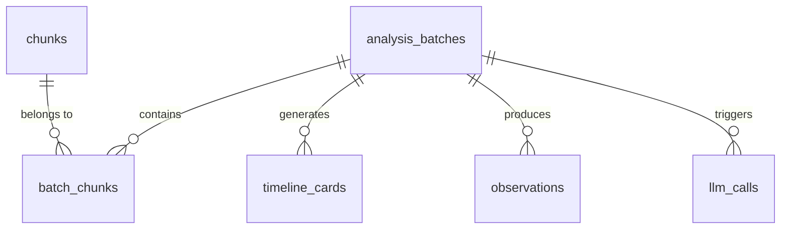

# Database Schema Documentation

## Overview

Dayflow uses a **GRDB SQLite database** for persistent storage of screen recordings metadata, AI analysis results, and timeline data.

**Database Location**: `~/Library/Application Support/Dayflow/chunks.sqlite`

## Schema Structure

### Core Tables

#### 1. `chunks` - Video Recording Segments
Stores metadata for individual 15-second video recordings captured at 1 FPS.

| Column | Type | Description |
|--------|------|-------------|
| `id` | INTEGER PRIMARY KEY | Unique identifier |
| `start_ts` | INTEGER NOT NULL | Unix timestamp when recording started |
| `end_ts` | INTEGER NOT NULL | Unix timestamp when recording ended |
| `file_url` | TEXT NOT NULL | File path to video (e.g., `~/Library/Application Support/Dayflow/recordings/...`) |
| `status` | TEXT NOT NULL | Recording status: `recording`, `completed`, `failed` |
| `is_deleted` | INTEGER | Soft delete flag (0 or 1) |

**Indexes**: `idx_chunks_status`, `idx_chunks_start_ts`

#### 2. `analysis_batches` - Processing Groups
Groups multiple chunks into ~15-minute logical batches for AI analysis.

| Column | Type | Description |
|--------|------|-------------|
| `id` | INTEGER PRIMARY KEY | Unique batch identifier |
| `batch_start_ts` | INTEGER NOT NULL | Unix timestamp for batch start |
| `batch_end_ts` | INTEGER NOT NULL | Unix timestamp for batch end |
| `status` | TEXT NOT NULL | Processing status: `pending`, `processing`, `completed`, `failed` |
| `reason` | TEXT | Error message if failed |
| `llm_metadata` | TEXT | JSON containing LLM call details |
| `detailed_transcription` | TEXT | Full transcription (deprecated) |
| `created_at` | DATETIME | When batch was created |

**Indexes**: `idx_analysis_batches_status`

#### 3. `batch_chunks` - Junction Table
Links batches to their constituent chunks (many-to-many relationship).

| Column | Type | Description |
|--------|------|-------------|
| `batch_id` | INTEGER NOT NULL | References `analysis_batches(id)` |
| `chunk_id` | INTEGER NOT NULL | References `chunks(id)` |

**Primary Key**: Composite (`batch_id`, `chunk_id`)

#### 4. `timeline_cards` - Activity Summaries
User-facing activity cards displayed in the timeline UI.

| Column | Type | Description |
|--------|------|-------------|
| `id` | INTEGER PRIMARY KEY | Unique card identifier |
| `batch_id` | INTEGER | References `analysis_batches(id)` |
| `start` | TEXT NOT NULL | Human-readable start time (e.g., "2:30 PM") |
| `end` | TEXT NOT NULL | Human-readable end time (e.g., "3:45 PM") |
| `start_ts` | INTEGER | Unix timestamp for activity start |
| `end_ts` | INTEGER | Unix timestamp for activity end |
| `day` | DATE NOT NULL | Date in YYYY-MM-DD format (4 AM boundary) |
| `title` | TEXT NOT NULL | Activity title |
| `summary` | TEXT | Brief activity description |
| `category` | TEXT NOT NULL | Main category: `Work`, `Personal`, `Distraction`, `Idle` |
| `subcategory` | TEXT | More specific categorization |
| `detailed_summary` | TEXT | Extended description |
| `metadata` | TEXT | JSON for distractions array and other data |
| `video_summary_url` | TEXT | Path to timelapse video |
| `created_at` | DATETIME | When card was created |

**Indexes**: `idx_timeline_cards_day`, `idx_timeline_cards_time_range`

#### 5. `observations` - AI Analysis Results
Raw observations from AI video analysis, used to generate timeline cards.

| Column | Type | Description |
|--------|------|-------------|
| `id` | INTEGER PRIMARY KEY | Unique observation identifier |
| `batch_id` | INTEGER NOT NULL | References `analysis_batches(id)` |
| `start_ts` | INTEGER NOT NULL | Unix timestamp for observation start |
| `end_ts` | INTEGER NOT NULL | Unix timestamp for observation end |
| `observation` | TEXT NOT NULL | AI-generated observation text |
| `metadata` | TEXT | Additional context/metadata |
| `llm_model` | TEXT | AI model used (e.g., "gemini-2.0-flash-exp") |
| `created_at` | DATETIME | When observation was created |

**Indexes**: `idx_observations_batch_id`, `idx_observations_start_ts`, `idx_observations_time_range`

#### 6. `llm_calls` - LLM API Call Logging
Tracks all LLM API calls for debugging and analytics.

| Column | Type | Description |
|--------|------|-------------|
| `id` | INTEGER PRIMARY KEY | Unique call identifier |
| `created_at` | DATETIME | When call was made |
| `batch_id` | INTEGER | Associated batch (if applicable) |
| `call_group_id` | TEXT | Groups related calls |
| `attempt` | INTEGER | Retry attempt number |
| `provider` | TEXT NOT NULL | LLM provider: `gemini`, `ollama`, `dayflow` |
| `model` | TEXT | Model name |
| `operation` | TEXT NOT NULL | Operation type: `transcribe`, `generate_cards` |
| `status` | TEXT NOT NULL | Call result: `success`, `failure` |
| `latency_ms` | INTEGER | Response time in milliseconds |
| `http_status` | INTEGER | HTTP response code |
| `request_method` | TEXT | HTTP method |
| `request_url` | TEXT | API endpoint |
| `request_headers` | TEXT | Request headers (JSON) |
| `request_body` | TEXT | Request payload |
| `response_headers` | TEXT | Response headers (JSON) |
| `response_body` | TEXT | Response payload |
| `error_message` | TEXT | Error details if failed |
| `token_input_count` | INTEGER | Input tokens consumed |
| `token_output_count` | INTEGER | Output tokens generated |
| `token_cached_count` | INTEGER | Cached tokens used |

## Data Relationships



## Time Handling

### 4 AM Logical Day Boundary
The system uses 4 AM as the logical day boundary to align with natural work patterns:
- Activities between 12:00 AM - 3:59 AM belong to the previous day
- Activities from 4:00 AM onwards belong to the current day
- Implemented in `StorageManager.logicalStartOfDay()` and `Date.getDayInfoFor4AMBoundary()`

### Timestamp Storage
- **Unix timestamps** (`start_ts`, `end_ts`): Stored as INTEGER (seconds since epoch)
- **Human-readable times** (`start`, `end`): Stored as TEXT (e.g., "2:30 PM")
- **Day field**: DATE string in YYYY-MM-DD format

## Data Lifecycle

### 1. Recording Phase
```sql
INSERT INTO chunks (start_ts, end_ts, file_url, status)
VALUES (1234567890, 1234567905, '/path/to/video.mp4', 'recording')
```

### 2. Batch Creation
```sql
-- Create batch
INSERT INTO analysis_batches (batch_start_ts, batch_end_ts, status)
VALUES (1234567890, 1234568790, 'pending')

-- Link chunks to batch
INSERT INTO batch_chunks (batch_id, chunk_id)
SELECT ?, id FROM chunks WHERE start_ts >= ? AND end_ts <= ?
```

### 3. AI Analysis
```sql
-- Store observations
INSERT INTO observations (batch_id, start_ts, end_ts, observation, llm_model)
VALUES (?, ?, ?, 'User working in Xcode...', 'gemini-2.0-flash-exp')

-- Update batch status
UPDATE analysis_batches SET status = 'completed' WHERE id = ?
```

### 4. Card Generation
```sql
INSERT INTO timeline_cards (
    batch_id, start, end, start_ts, end_ts, day,
    title, summary, category, video_summary_url
) VALUES (
    ?, '2:30 PM', '3:45 PM', ?, ?, '2025-01-15',
    'Coding in Xcode', 'Working on Dayflow features...', 'Work', '/path/to/timelapse.mp4'
)
```

### 5. Querying Timeline
```sql
-- Get cards for a specific day (with 4 AM boundary)
SELECT * FROM timeline_cards
WHERE day = '2025-01-15'
ORDER BY start_ts ASC

-- Get cards in time range
SELECT * FROM timeline_cards
WHERE start_ts >= ? AND end_ts <= ?
ORDER BY start_ts ASC
```

## Storage Management

### Video File Cleanup
When timeline cards are replaced or deleted, associated video files are removed:
1. Query `video_summary_url` from deleted cards
2. Delete physical files from filesystem
3. Remove database records

### Automatic Cleanup
- Video chunks older than 3 days are automatically deleted
- Orphaned batches without chunks are cleaned up
- Failed recordings are periodically purged

## Migration Strategy

The database schema is created automatically on first run. Future migrations can be added to the `migrator` in `StorageManager.init()`.

## Performance Considerations

### Indexes
Critical indexes for query performance:
- `idx_chunks_start_ts`: Fast chunk lookups by time
- `idx_timeline_cards_day`: Efficient daily timeline queries
- `idx_observations_time_range`: Quick observation searches

### Query Optimization
- Use parameterized queries to prevent SQL injection
- Batch inserts when creating multiple records
- Leverage indexes for time-based queries

## Backup Recommendations

To backup user data:
```bash
# Backup database
cp ~/Library/Application\ Support/Dayflow/chunks.sqlite ~/backup/

# Backup recordings (optional, large)
cp -r ~/Library/Application\ Support/Dayflow/recordings/ ~/backup/

# Backup timelapses
cp -r ~/Library/Application\ Support/Dayflow/timelapses/ ~/backup/
```